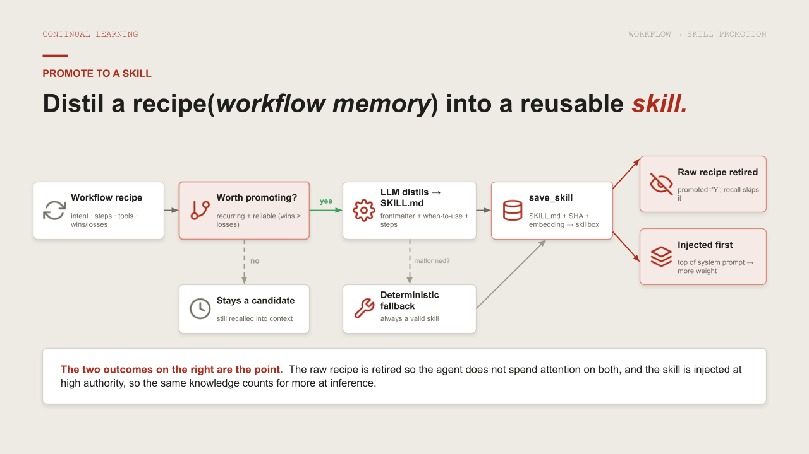

# 🧩 TODO 17 — Promote a workflow into a skill (continual learning in token space)



This is **continual learning in token space**: the agent did a task (a captured **workflow**), and
now it distils that trajectory into a reusable **skill**. The model rewrites the workflow's raw steps
into a parameterised `SKILL.md`; you save it and mark the workflow *promoted* so it stops showing up
as raw procedural memory. Next time a similar task arrives, the agent loads the polished skill instead
of re-deriving the steps from scratch.

### What to implement
Fill in `promote_workflow_to_skill(workflow_id)`:
1. Fetch the workflow (`SELECT id, intent, steps, tools_used FROM agent_workflow WHERE id=:i`); return
   `{"error": "no such workflow"}` if missing. Split `tools = [t for t in (wf["TOOLS_USED"] or
   "").split(",") if t]`.
2. Ask the model to distil it: build a prompt that returns JSON `{"name", "description", "body"}`,
   `llm.invoke([HumanMessage(content=prompt)]).content`, and parse the JSON slice. Wrap it in
   `try/except` with a **fallback** (derive `name` from the intent, `body = str(wf["STEPS"])`) so it
   still works offline.
3. `skill_md = _skill_md(name, desc, tools, body)`; `save_skill(name, desc, skill_md, tools,
   source_workflow_id=wf["ID"])`; `UPDATE agent_workflow SET promoted='Y' WHERE id=:i`. Return
   `{"promoted_skill": name, "skill_md": skill_md}`.

> 💡 The fallback matters: a learning step that *requires* a model call is fragile. Distil with the
> model when you can, degrade to the raw steps when you can't — either way the skill gets saved.

## ✅ Solution

Replace the placeholder cell with this, then run the **`✅ TODO 17 check`** cell:

```python

def promote_workflow_to_skill(workflow_id):
    wf = fetch_rows(conn, "SELECT id, intent, steps, tools_used FROM agent_workflow WHERE id=:i", {"i": workflow_id})
    if not wf:
        return {"error": "no such workflow"}
    wf = wf[0]
    tools = [t for t in (wf["TOOLS_USED"] or "").split(",") if t]
    prompt = (f"Distil this executed workflow into a reusable skill.\n"
              f"Intent: {wf['INTENT']}\nSteps: {wf['STEPS']}\nTools: {wf['TOOLS_USED']}\n"
              f'Return JSON: {{"name": "snake_case", "description": "one line", '
              f'"body": "numbered, parameterised steps as markdown"}}')
    try:
        from langchain_core.messages import HumanMessage
        out = llm.invoke([HumanMessage(content=prompt)]).content
        spec = json.loads(out[out.find("{"): out.rfind("}") + 1])
        name, desc, body = spec["name"], spec["description"], spec["body"]
    except Exception:
        name = (wf["INTENT"][:40] or "skill").strip().replace(" ", "_").lower()
        desc, body = f"Reusable playbook for: {wf['INTENT']}", str(wf["STEPS"])
    skill_md = _skill_md(name, desc, tools, body)
    save_skill(name, desc, skill_md, tools, source_workflow_id=wf["ID"])
    execute_sql(conn, "UPDATE agent_workflow SET promoted='Y' WHERE id=:i", {"i": wf["ID"]})  # retire from recall
    return {"promoted_skill": name, "skill_md": skill_md}

print("promote_workflow_to_skill ready (distils to SKILL.md, marks the workflow promoted).")
```

_Generated from `total_recall_complete.ipynb` — the exact reference implementation._
