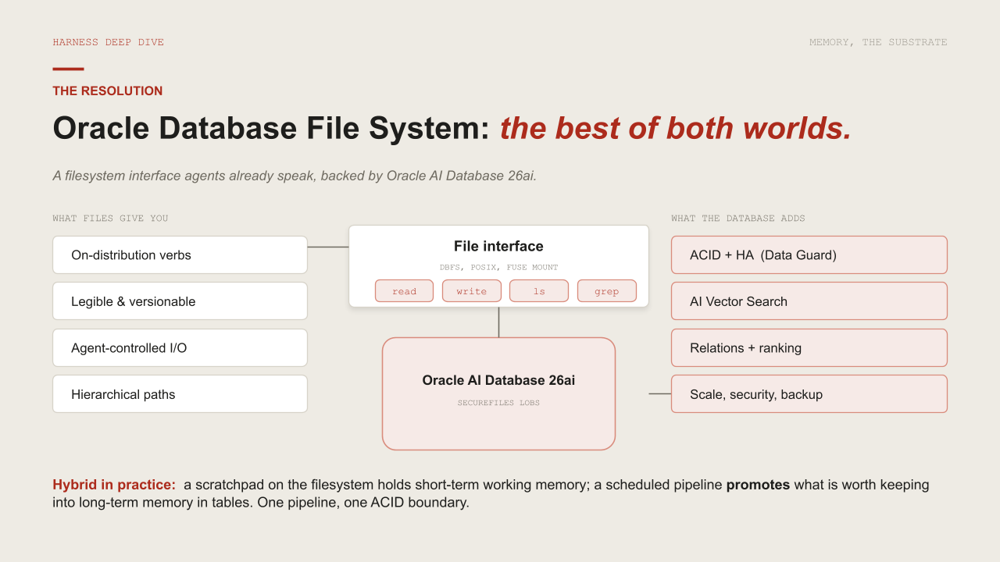

# 🧩 TODO 3 — The in-database scratch filesystem (write & read)



Before memory gets clever, an agent needs a **substrate** — somewhere to put working notes, partial
results, and scratch files. The classic choice is the OS filesystem; here we put it **inside the
database**, one row per file with the content in a SecureFile LOB. That single move buys us ACID
writes, transactional visibility, and (later) a promotion path straight into long-term memory — none
of which a loose file on disk gives you.

### What to implement
Fill in two methods of `ScratchFS` (keep `__init__`, `_abs`, `mkdir`, `append`, `exists`, `list`):
- `write(self, path, content)` — UPSERT one row. Compute `p = self._abs(path)`, encode text to bytes
  (`content.encode("utf-8") if isinstance(content, str) else content`), then run a `MERGE INTO
  agent_scratch … WHEN MATCHED THEN UPDATE SET content=:c, is_dir='N', promoted='N',
  updated_at=SYSTIMESTAMP WHEN NOT MATCHED THEN INSERT (path, content) VALUES (:p, :c)`.
- `read(self, path)` — `fetch_rows(self.conn, "SELECT content FROM agent_scratch WHERE path = :p",
  {"p": self._abs(path)})`; raise `FileNotFoundError` if empty; otherwise decode the BLOB to text
  (`b.decode("utf-8", errors="replace") if isinstance(b, (bytes, bytearray)) else (b or "")`).

> 💡 `MERGE` is the upsert: one statement that updates the row if the path exists and inserts it if
> not — so `write()` is idempotent and never throws a duplicate-key error.

## ✅ Solution

Replace the placeholder cell with this, then run the **`✅ TODO 3 check`** cell:

```python
class ScratchFS:
    """A POSIX-like filesystem inside the database (one row per file, content in a SecureFile LOB)."""
    def __init__(self, conn, mount="/scratch"):
        self.conn = conn
        self.mount = mount.rstrip("/")

    def _abs(self, path):
        path = "/" + path.strip("/")
        return path if path.startswith(self.mount) else self.mount + path

    def mkdir(self, path):
        p = self._abs(path)
        execute_sql(self.conn, '''MERGE INTO agent_scratch d USING (SELECT :p AS path FROM dual) s ON (d.path = s.path)
                        WHEN NOT MATCHED THEN INSERT (path, is_dir) VALUES (:p, 'Y')''', {"p": p})

    def write(self, path, content):
        p = self._abs(path)
        data = content.encode("utf-8") if isinstance(content, str) else content
        execute_sql(self.conn, '''MERGE INTO agent_scratch d USING (SELECT :p AS path FROM dual) s ON (d.path = s.path)
                        WHEN MATCHED THEN UPDATE SET content = :c, is_dir = 'N', promoted = 'N',
                                                     updated_at = SYSTIMESTAMP
                        WHEN NOT MATCHED THEN INSERT (path, content) VALUES (:p, :c)''', {"p": p, "c": data})

    def append(self, path, content):
        self.write(path, (self.read(path) if self.exists(path) else "") + content)

    def read(self, path):
        r = fetch_rows(self.conn, "SELECT content FROM agent_scratch WHERE path = :p", {"p": self._abs(path)})
        if not r:
            raise FileNotFoundError(self._abs(path))
        b = r[0]["CONTENT"]
        return b.decode("utf-8", errors="replace") if isinstance(b, (bytes, bytearray)) else (b or "")

    def exists(self, path):
        return bool(fetch_rows(self.conn, "SELECT 1 FROM agent_scratch WHERE path = :p", {"p": self._abs(path)}))

    def list(self, path="/"):
        pre = self._abs(path).rstrip("/") + "/%"
        rows = fetch_rows(self.conn, "SELECT path FROM agent_scratch WHERE path LIKE :pre AND is_dir = 'N' ORDER BY path",
                          {"pre": pre})
        return [r["PATH"] for r in rows]

print("ScratchFS class ready.")
```

_Generated from `total_recall_complete.ipynb` — the exact reference implementation._
