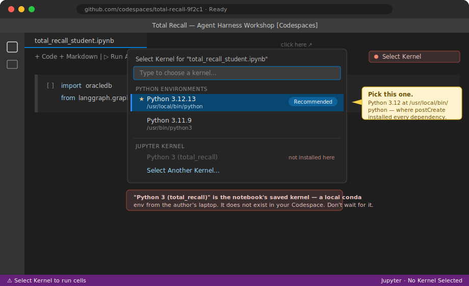
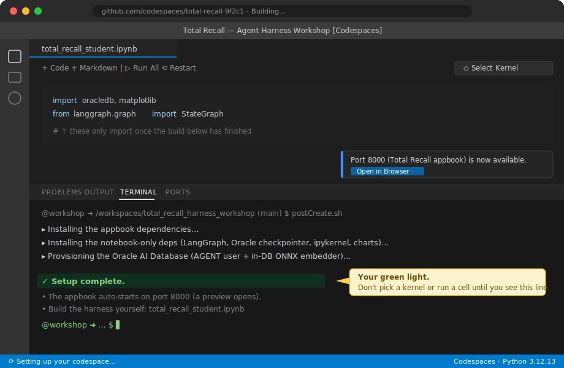

# Frequently Asked Questions

**Common GitHub Codespaces pitfalls — and how to dodge them.**

Almost every "it won't run" moment in this workshop comes down to one of two things: you picked the
**wrong notebook kernel**, or you started running cells **before the Codespace finished building**. They
are related — most "wrong kernel" problems are really "the build hadn't finished yet." This page shows you
exactly what each looks like and how to get to a green state.

> The screenshots below are **mock-ups for illustration** — your real Codespace will look very close to
> them, but version-to-version the wording may differ slightly.

---

## ✅ 30-second checklist before you run a single cell

1. The terminal shows **`✓ Setup complete.`** (the build finished) — see [Pitfall 2](#pitfall-2--wait-for-the-codespace-to-finish-building).
2. The notebook's top-right kernel button shows **`Python 3.12.x`**, *not* `Select Kernel` and *not*
   `Python 3 (total_recall)` — see [Pitfall 1](#pitfall-1--selecting-the-right-kernel).
3. Your **`OCI_GENAI_API_KEY`** is set as a Codespaces secret (only needed for the chat/agent cells).

If all three are true, run the first cell. `import oracledb, langgraph` should succeed with no output.

---

## Pitfall 1 — Selecting the right kernel

When you open `total_recall_student.ipynb` (or `total_recall_complete.ipynb`), VS Code asks which **kernel**
to run it with. Pick the wrong one and every cell fails.

**Symptom**

- The top-right of the notebook says **`Select Kernel`** and nothing runs, or
- You see **`ModuleNotFoundError: No module named 'oracledb'`** (or `langgraph`, `matplotlib`, …) even
  though the build installed them, or
- A kernel called **`Python 3 (total_recall)`** is offered but selecting it spins forever or errors.

**Why it happens**

These notebooks were authored on a laptop using a conda environment, so they carry a *saved* kernel name —
**`Python 3 (total_recall)`**. That environment **does not exist inside your Codespace**. The Codespace
instead installs every dependency into its **base interpreter, `/usr/local/bin/python` (Python 3.12)**. If you
chase the saved `total_recall` kernel — or pick some other Python — you'll be running against an environment
where the packages aren't installed.

**The fix**

1. Click **`Select Kernel`** (top-right of the notebook) — or run any cell and you'll be prompted.
2. Choose **`Python Environments…`**.
3. Pick **`Python 3.12.x`** at **`/usr/local/bin/python`** — it's the one marked **★ Recommended**.

<p align="center">
  
</p>

```text
Select Kernel ▸ Python Environments ▸ ★ Python 3.12.x   (/usr/local/bin/python)   ← pick this
                                        ✗ Python 3 (total_recall)  — local-only, not in the Codespace
```

> **Why 3.12?** The notebooks were built on Python 3.12 and the Codespace ships 3.12 — matching avoids subtle
> dependency mismatches. Only the **`ipykernel`** package is required for an environment to show up as a
> kernel, and `postCreate.sh` installs it into that interpreter for you.

> **Still don't see a good option?** The kernel list is empty or only shows stale entries until the build
> registers the interpreter. That's not a kernel problem — it's [Pitfall 2](#pitfall-2--wait-for-the-codespace-to-finish-building). Wait for `✓ Setup complete.`, then reopen the kernel picker.

---

## Pitfall 2 — Wait for the Codespace to finish building

Creating a Codespace is **not** instant. The page opens within seconds and the terminal is usable, but the
environment is still being assembled in the background. Run cells too early and they fail through no fault of
your own.

**Symptom**

- Imports fail with `ModuleNotFoundError` even though you picked the right kernel, or
- The Oracle connection cell errors (the database isn't provisioned yet), or
- The kernel picker is empty or missing the `Python 3.12` interpreter.

**Why it happens**

A Codespace starts up in phases. The long one is **`postCreateCommand`** — our `.devcontainer/postCreate.sh`
— which installs the appbook dependencies, then the notebook-only dependencies (LangGraph, the Oracle
checkpointer, `ipykernel`, charts), then **provisions the Oracle AI Database** (creates the `AGENT` user and
loads the in-database ONNX embedder). That takes **~2–4 minutes** on a fresh Codespace.

```text
Build container → Clone repo → postCreateCommand → postStartCommand → Ready
                                ▲ 2–4 min: installs deps + provisions Oracle (the one you wait on)
                                                   ▲ starts the appbook on port 8000
```

**How to know it's actually done**

Watch the **integrated terminal**. When setup finishes it prints a clear marker:

<p align="center">
  
</p>

Look for all of these:

- The terminal log ends with **`✓ Setup complete.`**
- The status bar stops showing **"Setting up your codespace…"**
- A toast announces **Port 8000 (Total Recall appbook)** is available, and a **preview of the appbook opens
  automatically** (the sidebar badge turns green as the harness warms).

Only then should you select a kernel and start running cells.

> **Don't panic if Oracle isn't ready on the first try.** Provisioning is **idempotent**. If `postCreate.sh`
> printed `Oracle not ready yet`, just re-run it from the terminal:
> ```bash
> python scripts/seed_oracle.py
> ```

> **Rebuilt or reopened the Codespace?** `postStartCommand` re-runs and the appbook restarts, but the heavy
> `postCreateCommand` install is cached — restarts are fast, and the database persists in a named volume.

---

## Other things that trip people up

| Symptom | Cause & fix |
|---|---|
| Chat / agent cells error; appbook **model** badge is red | **`OCI_GENAI_API_KEY`** isn't set. Add it as a **Codespaces secret** (org-level recommended), then rebuild or restart the Codespace so it's picked up. |
| Appbook didn't open | It auto-forwards on **port 8000**. Open the **Ports** tab and click the 🌐 for *Total Recall appbook*, or run `cd app && ./run.sh`. App log: `/tmp/total-recall-app.log`. |
| Architecture diagrams show as raw ` ```mermaid ` text | In a Codespace they render automatically; if not, ensure the **Markdown Preview Mermaid Support** extension (`bierner.markdown-mermaid`) is enabled and reload. |
| `reranker: fallback` in the appbook badge | Expected when the optional cross-encoder isn't loaded — the retrieval ladder still works. Not an error. |

---

## References

- [Manage Jupyter Kernels in VS Code](https://code.visualstudio.com/docs/datascience/jupyter-kernel-management) — the Select Kernel quick-pick, Python Environments, and why only `ipykernel` is required.
- [Deep dive into GitHub Codespaces](https://docs.github.com/en/codespaces/about-codespaces/deep-dive) — the creation lifecycle and where `postCreateCommand` runs.
- [Rebuilding the container in a codespace](https://docs.github.com/en/codespaces/developing-in-a-codespace/rebuilding-the-container-in-a-codespace) — what re-runs (and what's cached) on a rebuild.
- Workshop setup lives in [`.devcontainer/`](.devcontainer/) — `devcontainer.json`, `postCreate.sh`, `start-app.sh`. See the [README](README.md) for the full run-through.
